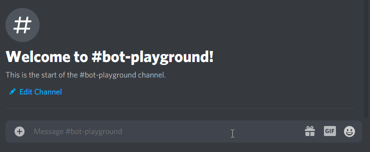

# Discord.js

[Discord.js](https://discord.js.org/) is a super snazzy library that lets is make extremely powerful Discord bots!

## Requirements

In order to use discord.js, we need to have [NodeJS](https://nodejs.org/en/download/) and NPM installed. Head [here](https://nodejs.org/en/download/) to download NodeJS (and NPM, which is packaged in to the download)!

If you are not on Mac or Windows, check out [here](https://nodejs.org/en/download/package-manager/) for more installation instructions.

## Lets get started

Be sure to have NodeJS installed!

You can check to make sure everything is installed properly by opening a terminal and running `node -v && npm -v` which should show two version numbers! As long as you get 2 lines of numbers, you'll be good for this lesson! If you're having problems, just Google `installing node [PLATFORM]`, like "installing node windows" and they should help you out. Google and StackOverflow is your friend!

### Setting up our project

Lets get started by going in to a directory that we want to do create our project. Open a terminal where you want your project to be.
```bash
mkdir my-discord-bot
cd my-discord-bot
```

Next, we're going to run `npm init -y` which will create some files for us! (the -y argument keeps everything at defaults. Remove -y if you want to specify project info, which tbh isn't important for this tutorial).

Now that we've set up our project, we can start installing stuff!

### Installing Modules

[NPM](https://www.npmjs.com/) is a package repository that allows us to install a variety of open source modules for our projects. We're going to start by installing [Discord.js](https://discord.js.org/), which we can do by running
```bash
npm install discord.js --save
```
(The --save flag adds this module to our package.json, which has a definition of the modules we install. This is very useful for giving your project to your friend or just remembering what you installed)

## Discord Servers

In order to use your discord bot, it needs to be added to a discord server.

You need administrative privileges to add a discord bot to a server.

If you do not already have the admin role in a server, below are the instructions to create a discord server.
<details>
<summary>Instructions to Create a Discord Server</summary>

Now that you are able to make a bot, you need to make a place for it to live. To get started, open up Discord and follow these steps:

1: Select the plus button at the bottom of your server list.


2: Select the "Create My Own" button.


3: Name the server whatever you want, and then click "Create"


You should now see a blank server in your server list!


</details>

## Registering your Discord Bot

In order to make a discord bot, you need to create an application on the [discord developer portal](https://discord.com/developers/applications).

Head [here](https://discord.com/developers/applications) and click on "New Application".

Once you've done that, head to the "Bot" tab and click "Add Bot", then click "Yes, do it!"

Now you have a bot! You should see a "Copy" button somewhere in the center of the screen. Don't click it yet, but remember where it is because we'll need to access it later.

## Coding our Discord Bot

Now that we've registered our discord bot, its time to build it!

To start, we need a `.js` file so we can write some code. Create a file called `index.js` in your project folder. (It can be whatever name you want, but 'index' is recommended because its the root of your project)
```bash
# Windows:
echo > index.js
# Max & Linux:
touch index.js
```

Now we need to require discord.js so we can use it to build our bot.

```js
// index.js
let Discord = require('discord.js');
let client = new Discord.Client();

client.on('ready', () => {
  console.log('Logged in as ' + client.user.tag);
});
```

But hold on... how do we get our bot to login? Well, remember when I said to remember where that "Copy" button was? Lets go back there.

In order for our bot to login, we need to use it's secret token so it can authenticate itself. Go ahead and click the copy button.

Now that you have your bot's token on your keyboard, we can put that in our program so it can login!

```js
// index.js
client.login('PASTE_YOUR_TOKEN_HERE');
// BE CAREFUL! If someone gets this token then they can login as your bot!
// Keep it secret! Keep it safe!
```

Eyy, out bot can login now! But we still need to add it to a server in order to properly use it.

## Adding your bot to a Discord Server

Go back to your [discord developer portal](https://discord.com/developers/applications), click on your bot, and go to the OAuth tab.

Scroll down to "OAuth2 URL Generator" and check the `bot` checkbox. After that, scroll down and check `Administrator`.

Once you've done that, copy the link it generated for you and open it up in a new tab.

From there, select the server dropdown and pick the discord server you want to add it to, then click Continue, then Authorize.

## Booting up your Bot

Now that your bot is in a server, we can make sure it works by starting our program up.

```bash
node index.js
```

You should see "Logged in as BOT_NAME#0000" and your bot should be set to "Online" on your server's member list!

## Receiving Messages

```js
// index.js
client.on('message', msg => {
  if (msg.content == 'ping') {
    msg.reply('Pong!');
  }
})
```

Stop your bot with `Ctrl+C`, then start it up again with `node index.js`!

Now type `ping` in one of the text channels on your server.



There's so much other things you can do with Discord bots! Check out the [Discord.js Documentation](https://discord.js.org/#/docs) for detailed specifications on everything you can do!

## Sending a message in a named channel

```js
// index.js
client.on('ready', () => {
  // This code needs to run after our bot is officially online and connected to discord
  client.channels.cache.find(channel => channel.name == 'lesson_chat').send('hi there!')
})
```

## Command System

Here's a pretty simple command system for your bot. Feel free to copy paste!

```js
// index.js
// Command System
let commands = {

};
let prefix = '/';
client.on('message', msg => {
  if (msg.content.substr(0, prefix.length) == prefix) {
    let cmd = msg.content.substr(prefix.length).split(' ')[0]; // get first word in our command
    if (cmd == 'help') { // Show our commands.
      msg.reply(
        'Commands:\r\n' + Object.entries(commands)
        .filter(([key, value]) => typeof value != 'string') // Filter out Alias's
        .map(([key, value]) => `${prefix}${value.syntax || key}: ${value.info}`) // Convert our commands to string format
        .join('\r\n') // Join by newline
    );
    } else {
      if (cmd in commands) {
        let command = commands[cmd];
        if (typeof command == 'string') { // Alias support
          commands[command].run(msg);
        } else {
          command.run(msg);
        }
      } else {
        msg.reply("Sorry, I don't know what command you're referring to! Say `" + prefix + "help` for more info.")
      }
    }
  }
})
```

### Magic 8-Ball

```js
// index.js
let commands = {
  // ...
  '8ball': {
    info: "Ask the Magic 8-ball for a response.", // For help command
    run(msg) {
      let responses = [
        'Yes',
        'No',
        'Maybe',
        'Perhaps',
        "That's up to you",
        "Ask again later",
        "For Certain",
        "Unlikely",
        // add more if you want
      ];
      let chosen = responses[Math.floor(Math.random() * responses.length)];
      msg.reply(chosen);
    },
  }
  '8-ball': '8ball', // Alias
  // ...
}
```

### Random Number Generator

```js
// index.js
let commands = {
  // ...
  'random': {
    syntax: 'random [number]',
    info: 'Generate a random number between 1 and 10, or 1 and a chosen integer.',
    run(msg) {
      let min = 1;
      let max = 10;
      let args = msg.content.trim().split(' ');
      args.shift(); // pop off first argument
      if (args.length >= 1) {
        max = Number(args[0]) || max;
      }
      msg.reply(Math.floor((Math.random() * max) + min));
    }
  }
  // ...
}
```

## Further Reading

Be sure to check out the [Discord.js Documentation](https://discord.js.org/#/docs)! They have everything you can do with your discord bot all nicely documented. Need to create a text channel? Kick a user? Anything? Their docs show you how you would do it!

[Discord.js Documentation](https://discord.js.org/#/docs) is your google for JavaScript discord bots.

There's also [Discord's own documentation](https://discord.dev) which should answer any questions you have!
